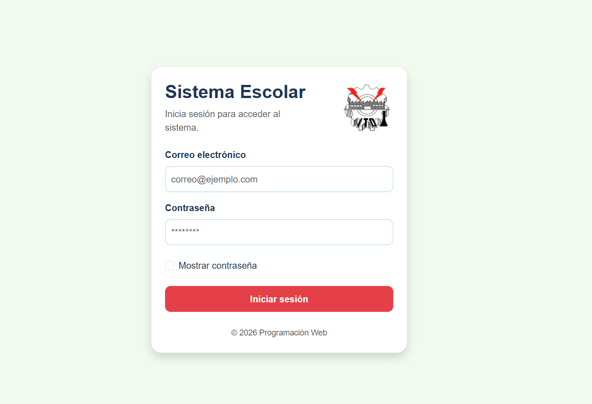
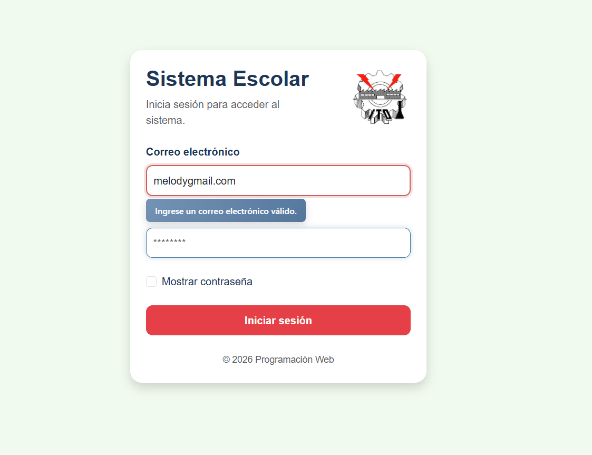
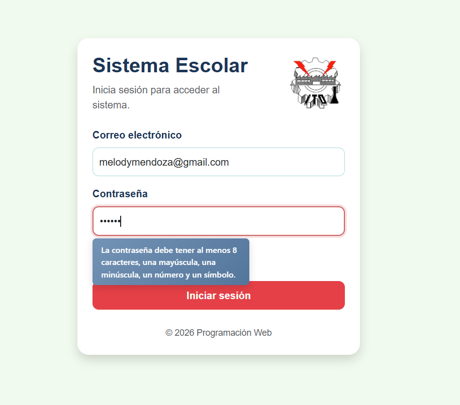
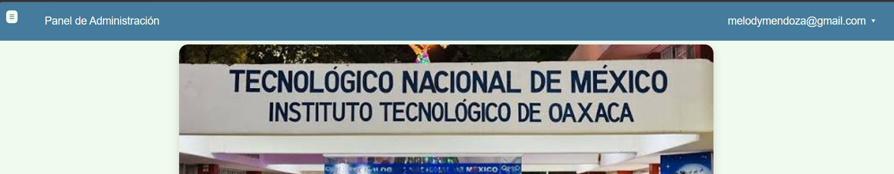

# Sistema Escolar

## Actividad 5 - Proyecto de Login

### Instituto Tecnológico Nacional de México

### Instituto Tecnológico de Oaxaca

**Materia:** Programación Web

**Docente:** Mtra. Adelina Martínez Nieto

---

# Integrantes

- **Mendez Garcia Angel de Jesus  23161028**
- **Mendoza Jimenez Melody Nathalie 23161034**


---

# Descripción

Este proyecto consiste en desarrollar un sistema escolar con un inicio de sesión utilizando HTML, CSS y JavaScript.

El sistema cuenta con un login que valida el correo y la contraseña antes de permitir el acceso. Después de iniciar sesión, el usuario entra a la pantalla principal del sistema, donde puede acceder a diferentes opciones mediante un menú lateral y una barra de navegación.

Para el desarrollo se reutilizaron componentes y librerías creadas previamente mediante **CDN**, permitiendo aprovechar código desarrollado en actividades anteriores sin necesidad de copiar archivos al proyecto.

---

# Framework utilizado

Se utilizó **Bootstrap 5** para construir la interfaz del login.

Bootstrap permitió crear una estructura adaptable utilizando tarjetas, formularios, botones y utilidades de alineación.

Además, se utilizó CSS personalizado para adaptar el diseño a la identidad visual del sistema escolar.

---

# Recursos reutilizados mediante CDN

Para este proyecto se integraron recursos desarrollados previamente y publicados mediante **jsDelivr**.

## Librería de Validaciones

Se utilizó una librería con funciones para validar el correo electrónico y la contraseña.

```javascript
import {
    validarCorreo,
    validarPassword
} from "https://cdn.jsdelivr.net/gh/Angel-2329/Programacion-WEB-7SC-Actividad-2@main/js/validaciones.js";
```

---

## Componente de Validaciones

Se utilizó un componente para mostrar mensajes de error debajo de los campos del formulario y una barra que indica la seguridad de la contraseña.

```javascript
import {
    componente_tipError,
    componente_Contraseña
} from "https://cdn.jsdelivr.net/gh/Angel-2329/Verano-de-Programacion-WEB-7SC-Actividad-3@main/js/componente.js";
```

---

## Componente Slider

También se integró un componente Slider desarrollado previamente y publicado mediante CDN.

```javascript
import {
    crearSlider
} from "https://cdn.jsdelivr.net/gh/Melody-Mendoza/ProgramacionWeb-7SC_Actividad3@main/js/componente.js";
```

Para aplicar el diseño del componente se utilizó el siguiente archivo CSS.

```html
<link rel="stylesheet"
href="https://cdn.jsdelivr.net/gh/Melody-Mendoza/ProgramacionWeb-7SC_Actividad3@main/css/componente.css">
```

---

# Flujo del sistema

```text
Login
   │
   ▼
Validación de correo y contraseña
   │
   ▼
Guardar usuario en sessionStorage
   │
   ▼
Ingreso al sistema principal
   │
   ▼
Mostrar usuario en el Navbar
   │
   ▼
Cerrar sesión
   │
   ▼
Regresar al Login
```

---

# ¿Cómo se comparte el usuario entre pantallas?

Cuando el usuario inicia sesión correctamente, el correo se guarda utilizando **sessionStorage**.

```javascript
sessionStorage.setItem("usuarioLogueado", correoUsuario);
```

Después, desde **index.js**, ese dato se recupera para mostrarlo en el Navbar mientras el usuario permanece dentro del sistema.

---

# Métodos principales

## validarCorreo()

Comprueba que el correo electrónico tenga un formato válido antes de permitir el acceso.

---

## validarPassword()

Verifica que la contraseña cumpla con los requisitos mínimos:

- Mínimo 8 caracteres.
- Al menos una letra mayúscula.
- Al menos una letra minúscula.
- Al menos un número.
- Al menos un carácter especial.

---

## componente_tipError()

Muestra mensajes de error debajo de los campos cuando el usuario introduce información incorrecta.

---

## componente_Contraseña()

Muestra una barra que indica el nivel de seguridad de la contraseña mientras el usuario la escribe.

---

## crearSlider()

Genera un carrusel de imágenes con botones de navegación, miniaturas y un mensaje tipo Toast.

---

# Desarrollo del proyecto

# Parte desarrollada por Melody Nathalie Mendoza Jiménez

## 1. Diseño del Login

Se diseñó la pantalla principal del sistema utilizando Bootstrap.

El formulario incluye:

- Logo institucional.
- Campo para correo electrónico.
- Campo para contraseña.
- Opción para mostrar la contraseña.
- Botón para iniciar sesión.

---

## 2. Diseño con CSS

Se personalizó Bootstrap utilizando la paleta de colores definida para el proyecto.

También se realizaron ajustes para que el login se adaptara correctamente a diferentes tamaños de pantalla.

---

## 3. Integración de la librería mediante CDN

Se reutilizó la librería de validaciones publicada previamente para validar el correo electrónico y la contraseña antes de permitir el acceso.

---

## 4. Integración del componente mediante CDN

Se integró un componente visual que muestra mensajes de error debajo de los campos del formulario y una barra de seguridad para la contraseña.

---

## 5. Inicio de sesión

Cuando las validaciones son correctas:

- Se guarda el usuario utilizando **sessionStorage**.
- Se redirecciona automáticamente hacia la pantalla principal del sistema.

```javascript
sessionStorage.setItem("usuarioLogueado", correoUsuario);

window.location.href = "index.html";
```

---

## 6. Integración del Slider

Se reutilizó un componente Slider desarrollado previamente y publicado mediante CDN.

El componente fue adaptado para mostrar imágenes relacionadas con el Instituto Tecnológico de Oaxaca, personalizando los colores para mantener la misma identidad visual del proyecto.

---

# Parte desarrollada por mi compañero

> **Esta sección será completada por el segundo integrante del equipo.**

En esta parte se documentará:

- Sidebar.
- Navbar.
- Captura de usuarios.
- Registro de alumnos.
- Modal de edad.
- Validaciones adicionales.
- Cierre de sesión.

---

# Proceso de creación

## Paso 1. Diseño del Login

Se comenzó diseñando la pantalla principal del sistema, la cual sería el punto de acceso para el usuario.

El formulario incluye:

- Correo electrónico.
- Contraseña.
- Opción para mostrar la contraseña.
- Botón para iniciar sesión.
- Logo y nombre del sistema.

La estructura principal se creó utilizando etiquetas HTML.

```html
<form id="formLogin">

    <input
        type="email"
        id="correo"
        placeholder="correo@ejemplo.com"
        required>

    <input
        type="password"
        id="password"
        required>

    <button type="submit">
        Iniciar sesión
    </button>

</form>
```

---

## Paso 2. Aplicación de Bootstrap

Una vez terminada la estructura del Login, se utilizó **Bootstrap 5** para organizar los elementos de la interfaz y facilitar el diseño adaptable.

Se emplearon principalmente componentes como:

- Container.
- Card.
- Form-control.
- Botones.
- Grid System.

Ejemplo:

```html
<div class="container vh-100 d-flex justify-content-center align-items-center">

    <div class="card login-card">

        ...

    </div>

</div>
```

Esto permitió centrar automáticamente el formulario y mejorar la presentación del sistema.

---

## Paso 3. Diseño con CSS personalizado

Después de aplicar Bootstrap, se personalizaron los estilos utilizando CSS para dar una identidad propia al proyecto.

Se definió una paleta de colores mediante variables CSS.

```css
:root{

    --color-fondo:#F1FAEE;
    --color-texto:#1D3557;
    --color-primario:#457B9D;
    --color-secundario:#A8DADC;
    --color-acento:#E63946;

}
```

También se modificaron elementos como:

- Botones.
- Formularios.
- Tarjeta del Login.
- Responsive.
- Efectos Hover.

---

## Paso 4. Integración de la librería mediante CDN

Para evitar copiar nuevamente el código de las validaciones, se reutilizó la librería desarrollada anteriormente mediante un CDN de **jsDelivr**.

La librería se importó directamente dentro del proyecto.

```javascript
import{
    validarCorreo,
    validarPassword
}
from "https://cdn.jsdelivr.net/gh/Angel-2329/Programacion-WEB-7SC-Actividad-2@main/js/validaciones.js";
```

De esta forma cualquier actualización realizada en la librería puede reutilizarse sin modificar el proyecto.

---

## Paso 5. Integración del componente mediante CDN

También se reutilizó el componente desarrollado previamente para mostrar mensajes de error debajo de los campos del formulario.

```javascript
import{

    componente_tipError,
    componente_Contraseña

}
from "https://cdn.jsdelivr.net/gh/Angel-2329/Verano-de-Programacion-WEB-7SC-Actividad-3@main/js/componente.js";
```

Además, se utilizó su hoja de estilos correspondiente.

```html
<link rel="stylesheet"
href="https://cdn.jsdelivr.net/gh/Angel-2329/Verano-de-Programacion-WEB-7SC-Actividad-3@main/css/componente.css">
```

Con esto se consiguió una validación más amigable para el usuario sin utilizar ventanas emergentes.

---

## Paso 6. Implementación de las validaciones del Login

Antes de permitir el acceso al sistema, se validó la información utilizando las funciones de la librería.

Primero se obtiene el contenido de los campos.

```javascript
const correo = correoInput.value.trim();
const password = passwordInput.value;
```

Después se realizan las validaciones.

```javascript
if(!validarCorreo(correo)){
    return;
}

if(!validarPassword(password)){
    return;
}
```

Si alguno de los datos es incorrecto, el componente muestra automáticamente el mensaje correspondiente debajo del campo.

---

## Paso 7. Guardar el usuario utilizando sessionStorage

Cuando las validaciones son correctas, el usuario se almacena temporalmente utilizando **sessionStorage**.

```javascript
sessionStorage.setItem(
    "usuarioLogueado",
    correo
);
```

Posteriormente el sistema redirecciona automáticamente a la página principal.

```javascript
window.location.href="index.html";
```

En la pantalla principal, el dato se recupera para mostrar el nombre del usuario dentro del Navbar.

```javascript
const usuarioActivo =
sessionStorage.getItem("usuarioLogueado");
```

---

## Paso 8. Integración del componente Slider mediante CDN

Finalmente se reutilizó un componente Slider desarrollado en una actividad anterior.

El componente fue publicado mediante CDN y posteriormente integrado al proyecto.

```javascript
import{
    crearSlider
}
from "https://cdn.jsdelivr.net/gh/Melody-Mendoza/ProgramacionWeb-7SC_Actividad3@main/js/componente.js";
```

Posteriormente se creó un arreglo con las imágenes del Instituto Tecnológico de Oaxaca.

```javascript
const escuela=[

    {
        imagen:"img/tec.jpg",
        titulo:"Instituto Tecnológico de Oaxaca",
        descripcion:"Bienvenido al Sistema Escolar."
    }

];
```

Finalmente se inicializó el componente.

```javascript
crearSlider(
    "contenedor-carrusel",
    escuela,
    "Conoce más sobre "
);
```

Con esto se logró integrar un componente reutilizable sin modificar su estructura principal, únicamente adaptando la información que se mostraría dentro del sistema.

---

## Paso 9

**(Espacio para que mi compañero documente el Sidebar y el Navbar.)**


---

## Paso 10

**(Espacio para que mi compañero documente el formulario de alumnos y el Modal.)**


---

# Capturas del funcionamiento

## Login

<p align="center">
  
</p>

---

## Validación del correo

<p align="center">
  
</p>

---

## Validación de la contraseña

<p align="center">
  
</p>

---

## Slider principal

<p align="center">
  
</p>

---

## Sidebar

<p align="center">
  
</p>

---

## Navbar

<p align="center">
  
</p>

---


## Registro de alumnos

📷

---

## Modal de edad

📷

---

## Cierre de sesión

📷

---

# Conclusión

Durante esta actividad se integraron componentes y librerías desarrollados previamente mediante **CDN**, lo que permitió reutilizar código y mantener una mejor organización del proyecto.

Además, se implementó un flujo completo de inicio de sesión utilizando **Bootstrap**, **JavaScript** y **sessionStorage**, integrando también componentes reutilizables como el Slider y las validaciones visuales para ofrecer una interfaz más amigable para el usuario.